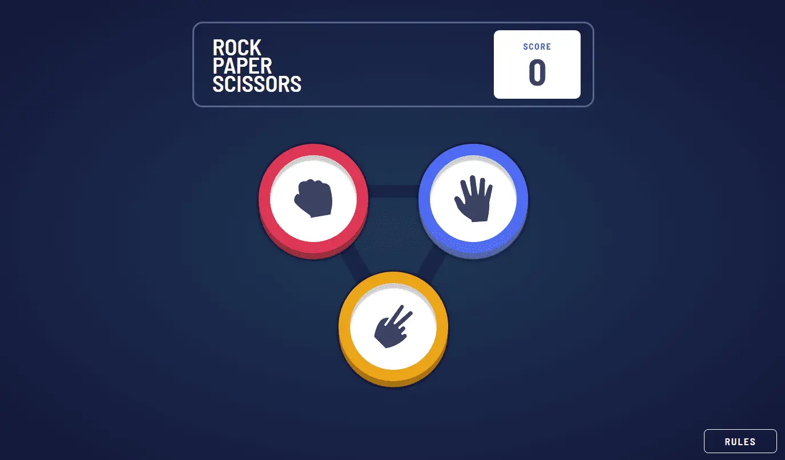

# Frontend Mentor - Rock, Paper, Scissors solution

This is a solution to the [Rock, Paper, Scissors challenge on Frontend Mentor](https://www.frontendmentor.io/challenges/rock-paper-scissors-game-pTgwgvgH). Frontend Mentor challenges help you improve your coding skills by building realistic projects. 

## Table of contents

- [Overview](#overview)
  - [The challenge](#the-challenge)
  - [Screenshot](#screenshot)
  - [Links](#links)
- [My process](#my-process)
  - [Built with](#built-with)
  - [What I learned](#what-i-learned)
  - [Useful resources](#useful-resources)
- [Author](#author)

**Note: Delete this note and update the table of contents based on what sections you keep.**

## Overview

### The challenge

Users are able to:

- View the optimal layout for the game depending on their device's screen size
- Play Rock, Paper, Scissors against the computer

### Screenshot

### Links

- Solution URL: [Add solution URL here](https://github.com/DenKuznets/rock-paper-scissors)
- Live Site URL: [Add live site URL here](https://rock-paper-scissors-kappa-tawny.vercel.app/)

## My process

### Built with

- [React](https://reactjs.org/) - JS library
- [TypeScript](https://www.typescriptlang.org/)
- [Material UI](https://mui.com/) - For styles
- Unit testing with Jest and React Testing Library
- [Storybook](https://storybook.js.org/)

### What I learned

I learned how to setup redux for jest testing, how to use Storybook with MUI (you need to google proper decorators function for typescript compatibility):

   export const decorators = [
            // Adds global styles and theme switching support.
            withThemeFromJSXProvider({
                GlobalStyles: CssBaseline,
                // Uncomment for theme switching
                Provider: ThemeProvider,
                themes: {
                    // Provide your custom themes here
                    light: Theme,
                    // dark: darkTheme,
                },
                defaultTheme: "light",
            }),
        ];

### Useful resources

- [redux docs](https://redux.js.org/usage/writing-tests) - This helped me to connect jest and redux.

## Author

- Website - [Denis Kuznetsov](https://denkuznets.vercel.app/)
- Frontend Mentor - [@DenKuznets](https://www.frontendmentor.io/profile/DenKuznets)
- Telegram - [@DenKuznets](https://t.me/DenKuznets)